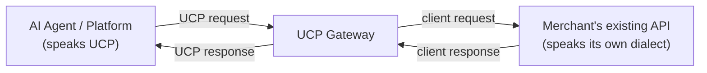
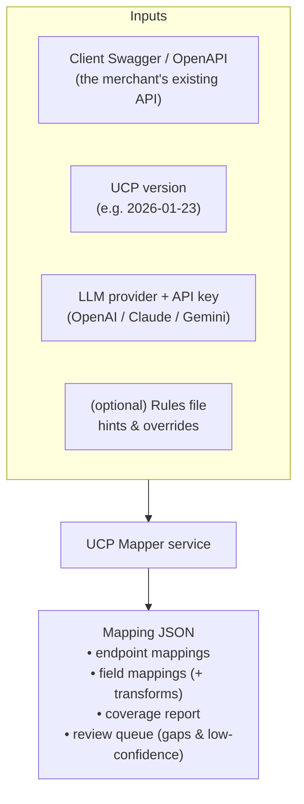
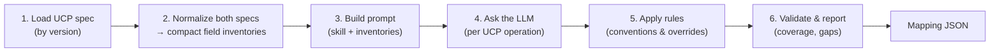

# 1. High-Level Architecture & Flow

> **Audience:** someone new to the UCP Mapper / gateway. This doc explains *what* it is, *why* it
> exists, and *how* the pieces fit — no code. For module internals see
> [02-low-level-architecture.md](02-low-level-architecture.md); for a hands-on run see
> [03-walkthrough-and-technical-details.md](03-walkthrough-and-technical-details.md).

---

## 1.1 The problem in one picture

AI shopping agents want to talk to *any* merchant using **one** standard language: the
**Universal Commerce Protocol (UCP)**. But every merchant already has their **own** e-commerce
API (its own endpoint names, field names, units, statuses). Rewriting every merchant backend to
"speak UCP" is not realistic.

A **gateway** solves this: it sits in front of the merchant's existing API and translates.

To translate, the gateway needs a **mapping**: which client endpoint realizes each UCP operation,
and how each UCP field is derived from the client's fields. **Producing that mapping is what this
project does.** Building the runtime gateway that *executes* it is a later phase.

---

## 1.2 Two products, one project

| Thing | What it is | Status |
|---|---|---|
| **The Mapper (this project)** | A service that **reads** a merchant's Swagger + the UCP spec and **writes** a mapping document (JSON). | Built — full checkout surface, real official schemas |
| **The Gateway runtime** | A server that **loads** that mapping JSON and translates live traffic. | Future phase |

The mapping JSON is the **contract** between them. Get the mapping right and the gateway is a
deterministic executor.

---

## 1.3 What the Mapper takes in and gives out

- **Input is the merchant's Swagger** — the Mapper does *not* require the merchant to change anything.
- **UCP version is a parameter** — the service loads that version's official schemas and maps against them.
- **The LLM is pluggable** — the same instruction file works with any provider; you bring the key.
- **Output is a single JSON document** your UI displays and the future gateway executes.

---

## 1.4 Why both AI *and* rules?

Mapping is fuzzy in places and exact in others, so we use each tool where it's strong:

- **AI (the LLM)** handles the *semantic* matching humans would do by reading docs — e.g. realizing
  the client's `sku` means the same as UCP's `item.id`, or `state` ≈ checkout `status`. Heuristics
  alone miss these.
- **Rules (deterministic code)** handle the *exact* parts and guardrails — UCP always uses **cents**
  and **RFC 3339**; ids are **server-generated**; required fields must be covered. Rules run *after*
  the AI and **win**, so output is consistent regardless of which model you picked, and money-related
  conventions are never left to chance.

---

## 1.5 The pipeline at a glance

1. **Load UCP spec** for the requested version (official multi-file schemas, vendored locally).
2. **Normalize** the UCP spec *and* the client Swagger into compact **field inventories** — flat lists
   of `path / type / required / description / unit hint`. This is the key trick that keeps the data
   small enough for the LLM and uniform on both sides.
3. **Build a prompt** combining the provider-neutral instruction file (`SKILL.md`) with the inventories
   — done **one UCP operation at a time** so prompts stay small.
4. **Ask the LLM** to produce the mapping JSON for that operation; the response is validated and
   auto-repaired if malformed.
5. **Apply rules** to enforce conventions (cents, dates), reuse client ids, mark server-authoritative
   fields as `computed`, and apply any human overrides.
6. **Validate & report** — recompute coverage against the real required fields, list genuine gaps and
   low-confidence matches in a review queue, and validate against the output schema.

---

## 1.6 Key ideas a newcomer should remember

- **Field inventory** — a spec (UCP or client) reduced to a flat list of fields. Both sides use the
  same shape, which makes matching tractable and keeps prompts small.
- **Mapping is not field-to-field.** A field mapping carries a **transform** (rename, dollars→cents,
  enum translation, …) and a **status**:
  - `mapped` — comes from a real client field,
  - `computed` — the server/gateway derives it (totals, ids, `ucp` metadata) — *no* client source,
  - `default` — no client source, a safe fixed value is used,
  - `unmapped` — a genuine **gap** needing human attention.
- **Endpoints can be 1-to-many or 0.** One UCP operation may need several client calls in sequence,
  or none (then it's flagged as an endpoint gap).
- **Coverage tells the truth.** The report says exactly how many required UCP fields are mapped /
  computed / defaulted / unmapped, so you know what a given client API *can* and *cannot* satisfy.

---

## 1.7 What "done" looks like today

- Full UCP **checkout** surface (`create / get / update / complete / cancel`) + the `discount`,
  `fulfillment`, `buyer_consent` extensions.
- Driven by the **real official UCP schemas** (version `2026-01-23`, vendored from the UCP repo).
- **OpenAI** provider wired end-to-end (Claude/Gemini drop into the same interface); verified live.
- Produces a schema-valid mapping JSON with coverage + review queue.

Next: more providers, more vendored versions, then the gateway runtime that executes the mapping.
