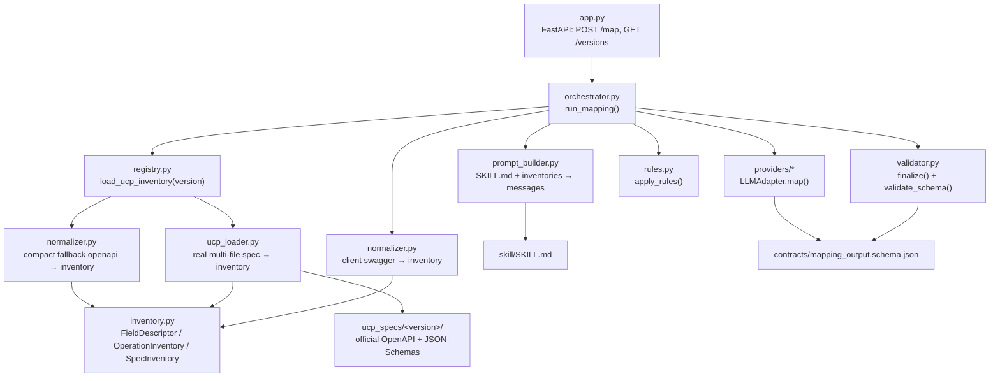
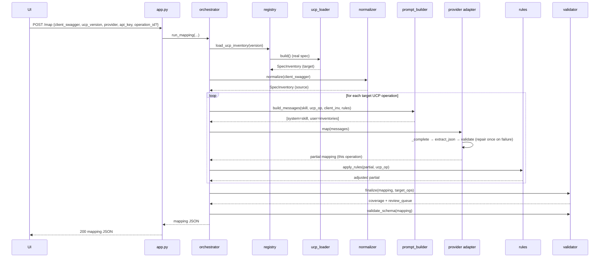
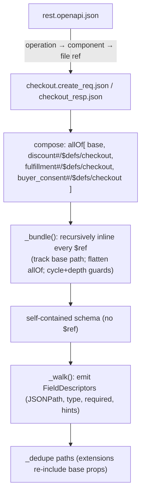
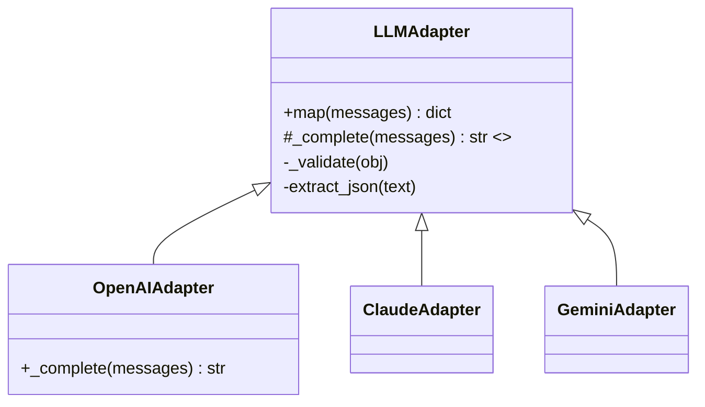

# 2. Low-Level Architecture & Flow

> **⚠️ Current state (v0.3) — read first.** Since this was written the orchestrator was split into
> **two phases** (`mapper/orchestrator.py`: `run_endpoint_mapping` → `run_field_mapping` (parallel) →
> `run_mapping`) with per-phase prompts (`prompt_builder.build_endpoint_messages` /
> `build_field_messages`) and per-phase output schemas (`phase_schemas.py`). New modules:
> `structures.py` (UCP + swagger structures for the UI), `capabilities.py` (operation→capability).
> The API now has 6 endpoints (see [README](../README.md)/[UI-INTEGRATION.md](UI-INTEGRATION.md)); the
> field rows are JSON-validated and **coerced** (`_coerce_field`) so a bad model row can't fail the
> whole artifact; output carries `capability`, row `id`s, and `coverage.by_capability`. The module
> descriptions below are still broadly correct but predate the two-phase split.

> **Audience:** a developer who has read [01-high-level-architecture.md](01-high-level-architecture.md)
> and now wants the module-by-module design, data structures, and control flow. Hands-on example in
> [03-walkthrough-and-technical-details.md](03-walkthrough-and-technical-details.md).

---

## 2.1 Module map



| File | Responsibility |
|---|---|
| `mapper/app.py` | HTTP surface. `POST /map`, `GET /versions`. Validates request, calls orchestrator, maps errors to HTTP codes. API key is transient (never logged/stored). |
| `mapper/orchestrator.py` | The pipeline. Loads inventories, loops over UCP operations, calls the LLM, applies rules, finalizes, validates. |
| `mapper/registry.py` | Resolves a UCP **version** to a normalized target inventory. Auto-detects real spec vs compact fallback. |
| `mapper/ucp_loader.py` | Loads the **real** official multi-file UCP spec: cross-file `$ref` resolution + extension composition (bundle-then-walk). |
| `mapper/normalizer.py` | Turns a single self-contained OpenAPI/JSON-Schema doc (the client swagger, or a compact UCP fallback) into an inventory. |
| `mapper/inventory.py` | The shared data model: `FieldDescriptor`, `OperationInventory`, `SpecInventory`. |
| `mapper/prompt_builder.py` | Assembles the provider-neutral prompt (skill file + injected inventories) per operation. |
| `mapper/providers/` | LLM adapters behind one interface (`base.py`), incl. JSON extract/validate/repair. `openai_adapter.py` is the live one. |
| `mapper/rules.py` | Deterministic post-LLM rules engine (conventions, id correlation, computed injection, overrides). |
| `mapper/validator.py` | Coverage aggregation, review-queue construction, output-schema validation. |
| `contracts/` | `mapping_output.schema.json` (output contract) + `transforms.md` (closed transform vocabulary). |
| `skill/SKILL.md` | The instruction file any LLM follows. |
| `ucp_specs/<version>/` | Vendored official UCP spec for that version. |

---

## 2.2 The shared data model

Everything between parsing and prompting flows through these (`inventory.py`):

```text
SpecInventory
├── title, version
└── operations: [ OperationInventory ]
        ├── operation_id        e.g. "create_checkout" / "createCart"
        ├── method, path        e.g. POST /checkout-sessions
        ├── summary
        ├── request_fields:  [ FieldDescriptor ]
        └── response_fields: [ FieldDescriptor ]

FieldDescriptor
├── path          JSONPath, e.g. $.line_items[*].item.id   ([*] = element-wise array)
├── type          string | integer | number | boolean | object | array
├── required      bool
├── enum          optional list of allowed values
├── description   one-line, from the spec
├── unit_hint     "cents" | "major_units" | None   (detected from name/type/desc)
└── format_hint   "date-time" | "uri" | None
```

Both the UCP target and the client source are reduced to this same shape — that uniformity is what
makes field matching and coverage computation straightforward.

---

## 2.3 End-to-end request flow



**Why per-operation looping?** Injecting the whole UCP spec + whole swagger into one prompt blows
the context window and degrades quality. Mapping one operation at a time keeps each prompt small and
focused; results are merged into one artifact at the end.

---

## 2.4 `ucp_loader.py` — resolving the real multi-file spec

The official spec is *not* one file. `services/shopping/rest.openapi.json` references per-operation
variant schemas (`checkout.create_req.json`, `checkout_resp.json`, …), which reference type schemas
by **relative path** (`types/line_item.json`, `../ucp.json#/$defs/...`). Extensions are separate
files exposing a `$defs.checkout` that `allOf`-composes their delta onto the base.

**Strategy: bundle-then-walk.**



- **`$ref` resolution** splits a ref into *file part* + *JSON pointer*; the file part is resolved
  **relative to the file currently being processed** (the loader threads a `base` path through
  recursion, so `../ucp.json` resolves correctly no matter how deep).
- **Cycle guard:** a `(base, ref)` pair already on the current path returns a stub `{type: object}`.
- **Depth guard:** recursion stops at a max depth (protects against deep/recursive product/category
  schemas).
- **Extension composition:** for each operation/direction the base variant file is `allOf`-merged
  with `discount` / `fulfillment` / `buyer_consent` `$defs.checkout`. Because `allOf` merges into a
  property dict, duplicate base props collapse naturally; a final `_dedupe` keeps the first path.

Output is the same `SpecInventory` shape — so the rest of the pipeline doesn't know or care that the
UCP side came from 80 files. (A compact single-file `openapi.json` is still accepted via
`normalizer.py` as a fallback; `registry.py` chooses.)

---

## 2.5 `normalizer.py` — the client swagger (and compact fallback)

Handles a single self-contained OpenAPI 3.x document with internal `#/components/schemas/...` refs:

- resolves internal `$ref` (one level, cycle-guarded),
- flattens `allOf`,
- walks objects/arrays into `FieldDescriptor`s,
- detects **unit hints** (`price/amount/total` + integer or "cents" → `cents`; number or "dollars"
  → `major_units`) and **format hints** (`date-time`, `uri`).

> Known limitation (D6): external multi-file `$ref` and Swagger 2.0→3.0 up-conversion on the *client*
> side are TODO. The UCP side already has full multi-file support via `ucp_loader`.

---

## 2.6 `providers/` — provider-agnostic LLM access



- Each concrete adapter implements only `_complete(messages) -> str` (raw assistant text).
- The base class owns the reliability logic (mitigating "any-LLM JSON" risk, **D2**):
  1. `extract_json` — pull a JSON object out of the text (handles code fences / stray prose),
  2. `_validate` — validate against `mapping_output.schema.json`,
  3. **repair loop** — on failure, re-prompt once with the validation error, then validate again.
- `temperature=0` for determinism. `OpenAIAdapter` uses the provider's native JSON mode.
- A `MockAdapter` (in `tests/`) returns canned valid mappings so the whole pipeline runs offline.

---

## 2.7 `rules.py` — the deterministic engine (runs after the LLM, wins over it)

Applied per operation. The rules:

| Rule | What it does |
|---|---|
| **R1a** | `$.ucp`, `$.totals`, `$.order.id`, `$.line_items[*].totals` → forced `computed` (no source). |
| **R1b** | **ID correlation:** `$.id`, `$.line_items[*].id` → keep as `mapped` from the client id when present (correlation key), else `computed`. |
| **R2** | **Cents convention:** money targets (`unit_hint == cents`) sourced via `copy`/`rename` are switched to `cents_from_major`; cents transforms get a default `scale: 100`. |
| **R3** | **Date convention:** `date-time` targets sourced via `copy`/`rename` switched to `date_rfc3339`. |
| **R5** | **Reconcile:** fix contradictory `(status, transform, source)` combos (e.g. a `default` with a value but flagged `unmapped` → `default`; `mapped` with no source → `unmapped`). |
| **R6** | **Inject computed:** for server-authoritative containers the model *omitted* (`$.ucp`, `$.id`, `$.status`, `$.totals`, `$.line_items[*].totals`, `$.order`), add a `computed` entry — so they don't show as false gaps. Only paths that exist in the real response schema are injected. |
| **R4** | **Overrides:** apply explicit pins from the optional rules file last (highest precedence). |

Rules are why output is consistent across providers and why server-authoritative fields are never
hallucinated as client-sourced.

---

## 2.8 `validator.py` — coverage & review queue

The validator **owns** coverage and the review queue (the model's self-reported queue is discarded
for determinism). Per operation:

1. **Endpoint-gap collapse** — if an operation's endpoint is unmapped (no client call), count all its
   required fields as `unmapped` but emit **one** `(endpoint)` review item instead of flooding.
2. **Coverage** — for each required UCP field, compute an **effective status** using ancestor/
   descendant awareness:
   - exact field entry wins;
   - else nearest **ancestor** entry (a `computed` parent like `$.ucp` covers `$.ucp.version`);
   - else any `mapped/computed/default` **descendant** (a container is realized by its children);
   - else `unmapped` (a true gap → review queue).
3. **Low-confidence review** — only **mapped** fields with `confidence < 0.6` are queued (uncertain
   matches worth a human look); optional unmapped fields are *not* treated as gaps.
4. **Schema validation** — the final artifact is validated against `mapping_output.schema.json`.

The `_on_branch` helper compares JSONPaths on segment boundaries so `$.line_items` never matches
`$.line_items_extra`.

---

## 2.9 The output contract (`contracts/mapping_output.schema.json`)

```text
{
  ucp_version, provider, generated_at?,
  endpoint_mappings: [ { ucp_operation, status(mapped|partial|unmapped),
                         confidence?, client_calls:[{operationId?,method,path,when}], notes? } ],
  field_mappings:    [ { ucp_operation, direction(request|response),
                         fields:[ { target_path, source_path?, transform, args,
                                    status(mapped|computed|default|unmapped), confidence?, rationale? } ] } ],
  coverage:    { required_total, mapped, defaulted, computed, unmapped },
  review_queue:[ { ucp_operation, direction?, target_path, reason, confidence? } ]
}
```

`transform` is a **closed enum** (see `contracts/transforms.md`): `copy, rename, const, default,
cents_from_major, major_from_cents, date_rfc3339, enum_map, concat, split, reshape, jsonpath_pick,
computed`. The future gateway implements exactly these — the LLM cannot invent transforms the
runtime can't execute.

---

## 2.10 Error handling & boundaries

- `registry.UnknownUcpVersionError` → HTTP **400** (version not vendored).
- `providers.base.LLMError` → HTTP **502** (provider/JSON failure after repair).
- `ValueError` (e.g. unknown operation) → HTTP **400**.
- The API key lives only for the duration of the request — not logged, not persisted (**D9**).
