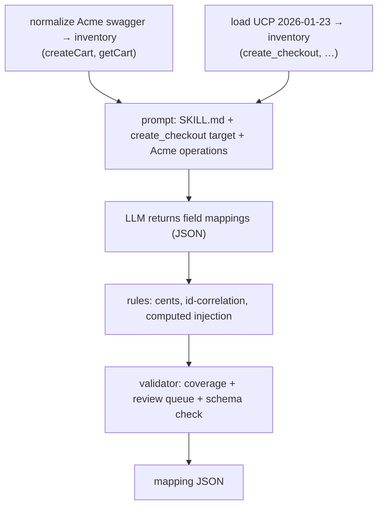

# 3. Walkthrough & Technical Details

> **Audience:** a developer who wants to run the Mapper, trace a real example end-to-end, and know
> the operational details. Read [01](01-high-level-architecture.md) and
> [02](02-low-level-architecture.md) first for context.

---

## 3.1 Project layout

```text
Mapper/
├── docs/                      ← you are here (01/02/03)
├── ANALYSIS.md                ← how UCP works + what "mapping" really involves
├── DESIGN-AND-FEASIBILITY.md  ← service design, difficulties D1–D10, build plan
├── VERTICAL-SLICE-PLAN.md     ← the first slice plan
├── README.md                  ← overview + how to run + how to vendor a version
├── requirements.txt
├── contracts/
│   ├── mapping_output.schema.json   ← OUTPUT contract (validated)
│   └── transforms.md                ← closed transform vocabulary + status discipline
├── skill/
│   └── SKILL.md                     ← provider-neutral instruction file the LLM follows
├── ucp_specs/
│   └── 2026-01-23/                  ← vendored OFFICIAL UCP spec (OpenAPI + ~80 JSON-Schemas)
│       ├── services/shopping/rest.openapi.json
│       └── schemas/**
├── mapper/                          ← the service
│   ├── app.py                       ← FastAPI: POST /map, GET /versions
│   ├── orchestrator.py              ← the pipeline
│   ├── registry.py                  ← version → UCP inventory
│   ├── ucp_loader.py                ← real multi-file spec loader (bundle-then-walk)
│   ├── normalizer.py                ← client swagger → inventory (+ compact UCP fallback)
│   ├── inventory.py                 ← FieldDescriptor / OperationInventory / SpecInventory
│   ├── prompt_builder.py            ← skill + inventories → messages
│   ├── providers/                   ← base.py, openai_adapter.py, __init__.py
│   ├── rules.py                     ← deterministic rules engine
│   └── validator.py                 ← coverage + review queue + schema validation
├── tests/
│   ├── fixtures/sample_client_swagger.json   ← the "Acme Shop" demo API
│   ├── mock_adapter.py                       ← offline deterministic LLM
│   └── test_slice_create_checkout.py         ← 5 offline tests
└── examples/
    ├── online_test.py               ← live runner (reads key from .env)
    ├── _inspect_real.py             ← dump the real UCP inventory
    └── sample_mapping.*.json        ← sample outputs
```

---

## 3.2 Setup & run

### Install
```powershell
cd Mapper
python -m venv .venv
.\.venv\Scripts\python.exe -m pip install -r requirements.txt
```

### Run the offline tests (no API key needed)
```powershell
.\.venv\Scripts\python.exe -m pytest -q
```
These use `tests/mock_adapter.py` (a deterministic fake LLM) so the entire pipeline —
registry → loader → normalizer → prompt → "LLM" → rules → validator — runs without network.

### Run live against a real model
1. Put your key in a gitignored file `Mapper/.env`:
   ```
   OPENAI_API_KEY=sk-...
   ```
2. Run:
   ```powershell
   .\.venv\Scripts\python.exe examples\online_test.py --operation create_checkout
   .\.venv\Scripts\python.exe examples\online_test.py --full      # all checkout operations
   ```
   Output is printed and written to `examples/online_mapping.openai.<scope>.json`.

### Serve the API
```powershell
.\.venv\Scripts\python.exe -m uvicorn mapper.app:app --reload
```
```http
POST /map
{ "client_swagger": { ... }, "ucp_version": "2026-01-23",
  "provider": "openai", "api_key": "sk-...", "operation_id": null }   # null = full surface
GET /versions        → { "ucp_versions": ["2026-01-23"] }
```

---

## 3.3 Worked example — Acme Shop → UCP `create_checkout`

### The client API (input)
`tests/fixtures/sample_client_swagger.json` is a deliberately simple storefront:

```jsonc
POST /api/cart  (createCart)
  request:  { products: [{ sku, qty }], customer: { name, email_address }, currency_code }
  response: { cart_id, state(open|locked|ordered|abandoned), currency_code,
              products: [{ line_id, sku, name, unit_price /*dollars*/, qty }], grand_total }
GET /api/cart/{cartId}  (getCart) → Cart
```

### The UCP target (loaded from the real spec)
`create_checkout` resolves to **57 request** and **103 response** fields, e.g.:

```text
request:   $.line_items[*].item.id (req), $.line_items[*].quantity (req),
           $.buyer.full_name?, $.buyer.email?, $.currency?, $.payment..., $.discounts..., $.fulfillment...
response:  $.ucp (req, server), $.id (req, server), $.status (req, enum),
           $.line_items[*].item.{id,title,price(cents)}, $.line_items[*].totals(cents),
           $.totals(cents), $.links, $.order.{id,permalink_url}, + discount/fulfillment/consent fields
```

### What the pipeline does



### The mapping it produces (live OpenAI `gpt-4o`, abridged)

Endpoint:
```json
{ "ucp_operation": "create_checkout", "status": "mapped", "confidence": 0.9,
  "client_calls": [ { "operationId": "createCart", "method": "POST", "path": "/api/cart" } ] }
```

Representative field mappings:
```jsonc
// request
{ "target_path": "$.line_items[*].item.id", "source_path": "$.products[*].sku",
  "transform": "rename", "status": "mapped", "confidence": 0.9 }
{ "target_path": "$.line_items[*].quantity", "source_path": "$.products[*].qty",
  "transform": "rename", "status": "mapped" }
{ "target_path": "$.buyer.full_name", "source_path": "$.customer.name", "transform": "rename" }

// response
{ "target_path": "$.id", "source_path": "$.cart_id",
  "transform": "rename", "status": "mapped" }                 // ← id correlation (rule R1b)
{ "target_path": "$.line_items[*].item.price", "source_path": "$.products[*].unit_price",
  "transform": "cents_from_major", "args": { "scale": 100 }, "status": "mapped" }  // dollars→cents (R2)
{ "target_path": "$.status", "source_path": "$.state", "transform": "enum_map",
  "args": { "map": { "open": "incomplete", "ordered": "completed", "abandoned": "canceled" } } }
{ "target_path": "$.totals", "transform": "computed", "status": "computed" }       // server-derived (R1a)
{ "target_path": "$.order",  "transform": "computed", "status": "computed" }       // injected (R6)
```

Coverage (real schema):
```json
{ "required_total": 44, "mapped": 9, "defaulted": 0, "computed": 11, "unmapped": 24 }
```

Review queue — only **genuine gaps** the Acme API can't satisfy:
`$.payment.instruments[*].*`, `$.fulfillment.methods[*].*`, `$.discounts.applied[*].*`, `$.links`, …

**How to read this:** a bare cart API covers ~20/44 required fields (9 from client data + 11 the
gateway computes). The other 24 need richer client endpoints, rules/defaults, or are genuinely out of
scope for this merchant — and the report names each one.

---

## 3.4 The transform vocabulary (closed set)

Every field mapping uses exactly one transform; the future gateway implements each deterministically.

| transform | meaning | example |
|---|---|---|
| `copy` | same name, same value | `$.email` → `$.buyer.email` |
| `rename` | different name, same value | `$.products[*].sku` → `$.line_items[*].item.id` |
| `const` | fixed value, no source | `[]` → `$.links` |
| `default` | source if present else fixed | `$.currency` default `"USD"` |
| `cents_from_major` / `major_from_cents` | dollars↔cents (`scale` arg) | `$.unit_price` → `$.item.price` |
| `date_rfc3339` | parse → RFC 3339 (`from` arg) | `$.created_at` → `$.expires_at` |
| `enum_map` | value dictionary (`map`,`default`) | `$.state` → `$.status` |
| `concat` / `split` | join/split strings | `first`+`last` → `full_name` |
| `reshape` | structural move only | flat → nested |
| `jsonpath_pick` | select a sub-value | nested → flat |
| `computed` | server/gateway derives it | `$.totals`, `$.id`, `$.ucp` |

**Status discipline:** `mapped` (real source) · `computed` (server-authoritative, no source) ·
`default` (no source, safe value) · `unmapped` (gap). The cardinal rule: **never invent a
`source_path`** to satisfy a required field — prefer `computed`/`default`/`unmapped`.

---

## 3.5 How the UCP spec is vendored (and how to add a version)

The official spec is multi-file. We pin a version by checking out the matching release branch of the
UCP repo and copying its built `spec/` tree:

```powershell
git clone --depth 1 -b release/2026-01-23 https://github.com/Universal-Commerce-Protocol/ucp .ucp_src
# copy .ucp_src/spec/schemas            -> ucp_specs/2026-01-23/schemas
# copy .ucp_src/spec/services/shopping  -> ucp_specs/2026-01-23/services/shopping
```

`.ucp_src/` is gitignored; only `ucp_specs/<version>/` is committed. To add `2026-04-08`, repeat with
that branch — `registry.py` auto-detects any version folder that contains
`services/shopping/rest.openapi.json` and loads it via `ucp_loader`.

> **Why pin a release branch?** UCP date-versions only bump on breaking changes. Pinning makes the
> mapper reproducible and offline; the `ucp_version` request parameter selects which vendored spec to
> map against.

---

## 3.6 How to add a new LLM provider

1. Create `mapper/providers/<name>_adapter.py` subclassing `LLMAdapter`; implement
   `default_model` and `_complete(messages) -> str` using that provider's SDK (prefer its native
   JSON/structured-output mode).
2. Register it in `mapper/providers/__init__.py` `_REGISTRY`.
3. That's it — `extract_json`, schema validation, and the repair loop are inherited from `base.py`,
   and the orchestrator/rules/validator are provider-agnostic.

The same `skill/SKILL.md` is sent to every provider; only the transport differs.

---

## 3.7 Testing

- `tests/test_slice_create_checkout.py` (5 tests, offline via `MockAdapter`):
  - the real UCP inventory loads `create_checkout` with expected paths + the `cents` hint on price,
  - the Acme swagger normalizes (`createCart` → `POST /api/cart`),
  - `run_mapping` produces a schema-valid artifact with server fields `computed` and price as
    `cents_from_major`, and coverage sums correctly,
  - full-surface mapping covers all 5 operations,
  - an unknown version raises `UnknownUcpVersionError`.
- `examples/_inspect_real.py` dumps the real inventory for manual inspection.

Run: `.\.venv\Scripts\python.exe -m pytest -q`.

---

## 3.8 Design rationale recap (the "why")

| Decision | Why |
|---|---|
| Normalize to **field inventories** | Keeps prompts small and both sides uniform (context risk **D1**). |
| **Per-operation** prompting | One operation's fields fit comfortably; results merged at the end. |
| **Closed transform vocabulary** | The gateway can execute every transform; LLM can't invent un-runnable ones (**D5**). |
| **Status discipline** + rules | Server-authoritative fields are never hallucinated as client-sourced (**D4**). |
| Rules **win** over the LLM | Deterministic, provider-independent, auditable output (**D3**). |
| Validator **owns** the review queue | No noisy model self-reports; gaps are computed from real required fields. |
| **Pin & vendor** UCP versions | Reproducible, offline, version-parameterized (**D8**). |

---

## 3.9 Current limitations / TODO

- **Client-side normalizer** handles a single self-contained OpenAPI 3.x doc only; external
  multi-file `$ref` and Swagger 2.0→3.0 up-conversion are TODO (**D6**). (UCP side already does multi-file.)
- A few `ucp.*` map-typed fields (`services`, `capabilities`, `payment_handlers`) render as `string`
  because they use `additionalProperties` rather than `properties` — cosmetic; they're computed anyway.
- `$.line_items[*].id` can still appear as a gap when the model omits it (id-correlation only rewrites
  emitted entries; could be added to R6's injection list).
- Only **OpenAI** is wired; **Claude/Gemini** adapters are not implemented yet.
- Only **`2026-01-23`** is vendored.
- The **gateway runtime** that executes the mapping artifact is a future phase.

---

## 3.10 Glossary

- **UCP** — Universal Commerce Protocol; the standard the agent speaks.
- **Capability** — a versioned UCP feature, e.g. `dev.ucp.shopping.checkout`.
- **Extension** — optional add-on composed onto a capability via JSON-Schema `allOf` (discount,
  fulfillment, buyer_consent).
- **Gateway** — the runtime that fronts a merchant API and translates UCP ↔ client (future phase).
- **Mapping artifact** — the JSON this service produces; the contract the gateway executes.
- **Field inventory** — a spec reduced to a flat list of `FieldDescriptor`s.
- **Transform** — a named, executable conversion from a client field to a UCP field.
- **Status** — `mapped` / `computed` / `default` / `unmapped` for each target field.
- **Coverage** — counts of required UCP fields by final status.
- **Review queue** — genuine gaps + low-confidence matches needing human attention.
